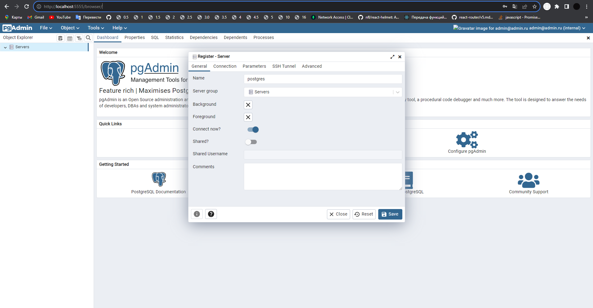

# BattleCity

"Баттл Сити" или "Танчики" — это классическая игра, созданная еще в 1985 году для игровых приставок и персональных компьютеров. Игра предлагает игрокам управлять танками в лабиринте, где они сражаются против вражеских танков и защищают свою базу.

Игровое поле представляет собой лабиринт, где расставлены стены и препятствия. Игрок управляет танком, стреляя по вражеским танкам и разрушая стены для прохождения. Цель состоит в том, чтобы уничтожить все вражеские танки на уровне и защитить свою базу от их атак.

  
  
  

### Этапы сборки проекта: подробная демонстрация пошагового процесса:

Ссылка на первое видео с демонстрацией работоспособности и функциональности приложения:
[https://cloud.mail.ru/public/aufs/ZLTNGpKE9](https://cloud.mail.ru/home/DEMO_TANKS.mp4)

Ссылка на второе видео с демонстрацией работоспособности и функциональности приложения:
https://cloud.mail.ru/public/tka2/JXMdTwgVC

**Демонстрация полностью законченного проекта:**:
https://cloud.mail.ru/home/videocideo.mp4

### Как запускать?

1. Убедитесь что у вас установлен `node` и `docker
2. Выполните команду `yarn bootstrap` - это обязательный шаг, без него ничего работать не будет :)
3. Выполните команду `yarn prod`
4. Выполните команду `yarn start:client` чтобы запустить только клиент
5. Выполните команду `yarn start:server` чтобы запустить только server

( Для корректной сборки с помощью скрипта dev вам следует открыть файл emojiAPI.ts )

### Как протестировать работу сервера?

Если вы хотите протестировать сервер, пожалуйста воспользуйтесь ["Production окружение в докере"](#production-окружение-в-докере), которое описано ниже.

Если вы не хотите запускать сервер через **docker**, вам следует _изменить_ в файле **db.ts в папке server/src**, переменные окружения на свои ( которые существуют на вашей локальной БД ), написать их при инициализации БД вручную

### Как добавить зависимости?

В этом проекте используется `monorepo` на основе [`lerna`](https://github.com/lerna/lerna)

Чтобы добавить зависимость для клиента
`yarn lerna add {your_dep} --scope client`

Для сервера
`yarn lerna add {your_dep} --scope server`

И для клиента и для сервера
`yarn lerna add {your_dep}`

Если вы хотите добавить dev зависимость, проделайте то же самое, но с флагом `dev`
`yarn lerna add {your_dep} --dev --scope server`

### Тесты

Для клиента используется [`react-testing-library`](https://testing-library.com/docs/react-testing-library/intro/)

`yarn test`

### Линтинг

`yarn lint`

### Форматирование prettier

`yarn format`

### Production build

- Для клиента:
  `yarn build:client`

- Для сервера:
  `yarn build:server`

## Хуки

В проекте используется [lefthook](https://github.com/evilmartians/lefthook)
Если очень-очень нужно пропустить проверки, используйте `--no-verify` (но не злоупотребляйте :)

## Production окружение в докере

Перед первым запуском выполните `node init.js`

`docker compose up` - запустит 6 сервисов

1. **_nginx_**, раздающий клиентскую статику (client)

2. **_certbot_**, инструмент для получения SSL-сертификатов.
3. **_client_**, клиентская часть приложения
4. **_server_**, ваш сервер
5. **_postgres_**, СУБД, используемая для хранения данных.
6. **_pgadmin_**, инструмент для администрирования баз данных PostgreSQL.

Если вам понадобится только один сервис, просто уточните какой в команде
`docker compose up {sevice_name}`, например `docker compose up server`

Вы должны увидеть следующие **_сообщения в консоли_**:

  
  
  
  

Если все работает корректно и без ошибок, вы должны зайти в pgAdmin и создать там вашу БД:

1. Перейдите по **_localhost:5555_**, перед вами откроется начальная страница **_pgAdmin_**, вы должны заполнить поля в соответствии с вашими **_env переменными_**, если вы ничего не изменяли, то для входа в систему вы должны прописать:

- login: admin@admin.ru
- password: secret

 

2. После успешного входа, создайте вашу БД, **_нажмите на Add New Server_**
 

   

3. Заполните поля во вкладке **_general и connection_**, если вы также ничего не изменяли в файле env, **_заполните все существующие поля, за исключением пароля, напишите postgres, пароль: password_** и нажмите на кнопку Save

  

  

4. После успешного создания вашей БД ( которую вы можете посмотреть слева в Servers ), **перезапустите ваш** `docker-compose` и у вас должно все работать.
